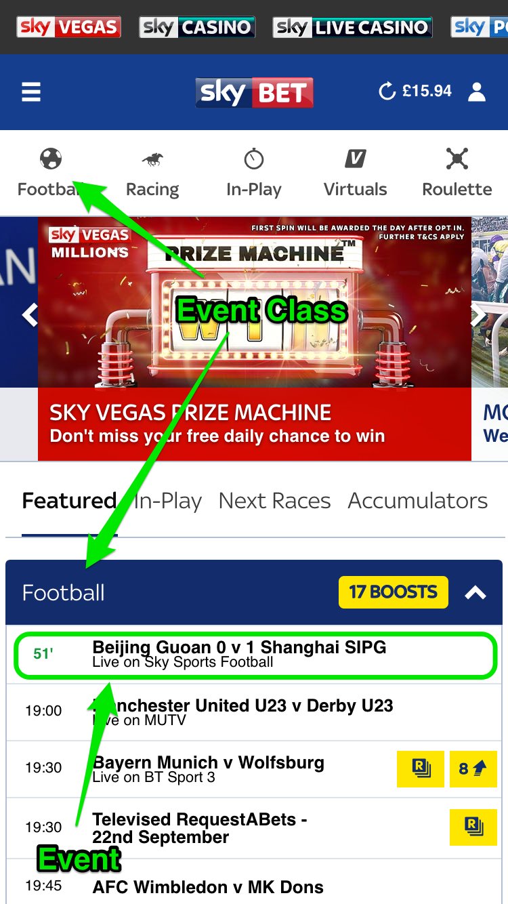
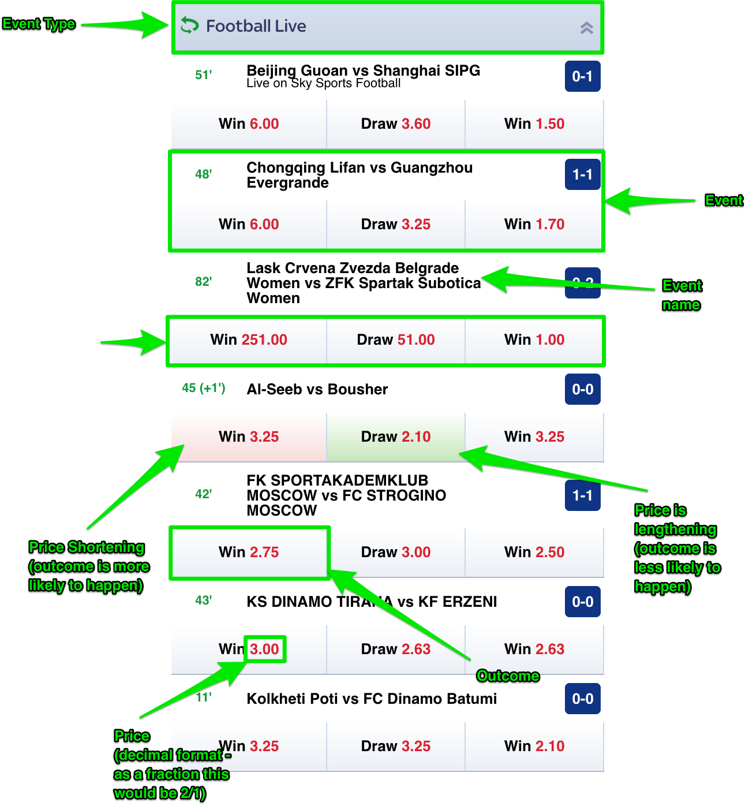
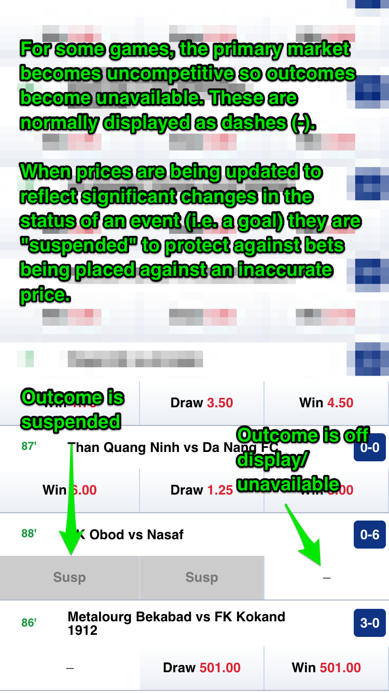
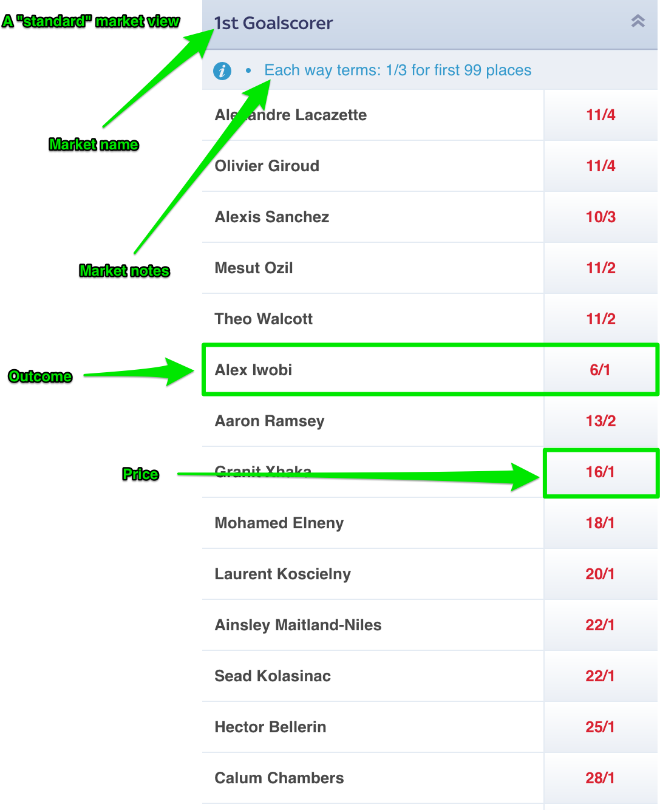

# Background To The Test

## Useful Terms

### Event

An event is a collection of betting opportunities typically linked to a specific real-world event such as a football match, horse race or TV show (yes, really). For the purposes of this test, an event always refers to a football match. 

### Event Class

The "class" of an event typically links to the type of sport the event belongs to. While a typical betting website offers odds on more than just sports, for the purposes of this test you can assume that `classId` implicitly means `sportId`. All the events will belong to the "Football" class.

### Event Type

The "type" of an Event refers to the competition or grouping of an event. For example, in the Football class, types typically refer to competitions such as "Premier League", "FA Cup" and "Football Live".

Live Football events have an extra type hint (`linkedEventTypeName`) so it is possible to link a live game to the original competition it belonged to. The reasons behind having a "Football Live" type are long and complicated and will not help with your submission for this test!

### Price

A price represents the odds for a specific betting opportunity. Prices are typically represented as fractions (10/1) or decimals to two decimal places (11.00)

### Outcome

An outcome refers to a price and the name of a specific betting opportunity. For example, in the "Both Teams To Score" market, an outcome would include a name (i.e. "Yes") and a price (i.e. "10/1").

Outcomes can also include a `type` property which is used to help with non-standard display of markets. E.g. an outcome belonging to a `win-draw-win` style market will have a type that describes its position - either `home`, `draw` or `away`

Outcomes have various status flags, the most relevant to this test being the `suspended` property. This indicates is the price is available to bet on or not.

Confusingly, outcomes can also be known as "selections". While that terminology isn't used here, if you have some experience of betting you might have heard this phrase and it's worth noting that they are effectively the same thing.

### Market

A market represents a grouping of outcomes and sets the contexts for each of the bets you can place. For example, the "Full Time Result" market offers three outcomes "Home", "Draw" or "Away" (although the names for "Home" and "Away" can differ).

Similar to outcomes, a market can have a `type` property which can be used to decide on a different type of layout to best suit the format of the outcomes.

Markets can also be `suspended` - this affects all prices belonging to the market and any API responses and websocket messages should reflect this relationship so all data remains in sync.


## Visual Examples










## Appendix A: Event Response Example

```javascript
{
   "outcomes" : {
      "93649824" : [
         {
            "marketId" : 93649824,
            "status" : {
               "cashoutable" : true,
               "displayable" : true,
               "result" : "-",
               "resulted" : false,
               "active" : true,
               "suspended" : false
            },
            "price" : {
               "den" : 5000,
               "num" : 1,
               "decimal" : 1.0002
            },
            "outcomeId" : 367530417,
            "type" : "under",
            "displayOrder" : 10,
            "eventId" : 21249939,
            "result" : {
               "place" : 0,
               "result" : "-",
               "favourite" : false
            },
            "name" : "Under"
         },
         {
            "status" : {
               "resulted" : false,
               "result" : "-",
               "displayable" : true,
               "active" : true,
               "suspended" : false,
               "cashoutable" : true
            },
            "price" : {
               "decimal" : 67,
               "num" : 66,
               "den" : 1
            },
            "marketId" : 93649824,
            "outcomeId" : 367530424,
            "displayOrder" : 20,
            "eventId" : 21249939,
            "result" : {
               "favourite" : false,
               "result" : "-",
               "place" : 0
            },
            "type" : "over",
            "name" : "Over"
         }
      ],
      "93649817" : [
         {
            "name" : "Under",
            "linkedOutcomeId" : 367657870,
            "result" : {
               "favourite" : false,
               "result" : "-",
               "place" : 0
            },
            "eventId" : 21249939,
            "displayOrder" : 10,
            "type" : "under",
            "outcomeId" : 367530397,
            "status" : {
               "cashoutable" : true,
               "active" : true,
               "suspended" : false,
               "result" : "-",
               "resulted" : false,
               "displayable" : true
            },
            "price" : {
               "decimal" : 1.004,
               "den" : 250,
               "num" : 1
            },
            "marketId" : 93649817
         },
         {
            "outcomeId" : 367530402,
            "marketId" : 93649817,
            "price" : {
               "den" : 1,
               "num" : 25,
               "decimal" : 26
            },
            "status" : {
               "displayable" : true,
               "result" : "-",
               "resulted" : false,
               "active" : true,
               "suspended" : false,
               "cashoutable" : true
            },
            "linkedOutcomeId" : 367657871,
            "name" : "Over",
            "type" : "over",
            "eventId" : 21249939,
            "result" : {
               "favourite" : false,
               "place" : 0,
               "result" : "-"
            },
            "displayOrder" : 20
         }
      ],
      "93649795" : [
         {
            "linkedOutcomeId" : 367657864,
            "name" : "Under",
            "type" : "under",
            "displayOrder" : 10,
            "result" : {
               "favourite" : false,
               "place" : 0,
               "result" : "-"
            },
            "eventId" : 21249939,
            "outcomeId" : 367530340,
            "marketId" : 93649795,
            "price" : {
               "den" : 20,
               "num" : 29,
               "decimal" : 2.45
            },
            "status" : {
               "active" : true,
               "suspended" : false,
               "result" : "-",
               "resulted" : false,
               "displayable" : true,
               "cashoutable" : true
            }
         },
         {
            "eventId" : 21249939,
            "result" : {
               "place" : 0,
               "result" : "-",
               "favourite" : false
            },
            "displayOrder" : 20,
            "type" : "over",
            "name" : "Over",
            "linkedOutcomeId" : 367657865,
            "status" : {
               "cashoutable" : true,
               "resulted" : false,
               "result" : "-",
               "displayable" : true,
               "active" : true,
               "suspended" : false
            },
            "price" : {
               "den" : 2,
               "num" : 1,
               "decimal" : 1.5
            },
            "marketId" : 93649795,
            "outcomeId" : 367530346
         }
      ],
      "93649441" : [
         {
            "status" : {
               "result" : "-",
               "resulted" : false,
               "displayable" : true,
               "suspended" : false,
               "active" : true,
               "cashoutable" : false
            },
            "price" : {
               "den" : 20,
               "num" : 29,
               "decimal" : 2.45
            },
            "marketId" : 93649441,
            "outcomeId" : 367529141,
            "eventId" : 21249939,
            "result" : {
               "place" : 0,
               "result" : "-",
               "favourite" : false
            },
            "displayOrder" : 0,
            "name" : "No Score"
         },
         {
            "status" : {
               "suspended" : false,
               "active" : true,
               "result" : "-",
               "resulted" : false,
               "displayable" : true,
               "cashoutable" : false
            },
            "price" : {
               "num" : 5,
               "den" : 2,
               "decimal" : 3.5
            },
            "marketId" : 93649441,
            "outcomeId" : 367529124,
            "displayOrder" : 1,
            "result" : {
               "favourite" : false,
               "place" : 0,
               "result" : "-"
            },
            "eventId" : 21249939,
            "name" : "Shanghai Shenhua"
         },
         {
            "status" : {
               "cashoutable" : false,
               "suspended" : false,
               "active" : true,
               "result" : "-",
               "resulted" : false,
               "displayable" : true
            },
            "price" : {
               "den" : 4,
               "num" : 6,
               "decimal" : 2.5
            },
            "marketId" : 93649441,
            "outcomeId" : 367529134,
            "displayOrder" : 2000,
            "eventId" : 21249939,
            "result" : {
               "result" : "-",
               "place" : 0,
               "favourite" : false
            },
            "name" : "Shandong Luneng Taishan"
         }
      ],
      "93649800" : [
         {
            "result" : {
               "favourite" : false,
               "place" : 0,
               "result" : "-"
            },
            "eventId" : 21249939,
            "displayOrder" : 10,
            "type" : "under",
            "name" : "Under",
            "linkedOutcomeId" : 367657866,
            "price" : {
               "num" : 2,
               "den" : 7,
               "decimal" : 1.28571428571429
            },
            "status" : {
               "suspended" : false,
               "active" : true,
               "resulted" : false,
               "result" : "-",
               "displayable" : true,
               "cashoutable" : true
            },
            "marketId" : 93649800,
            "outcomeId" : 367530357
         },
         {
            "price" : {
               "den" : 2,
               "num" : 5,
               "decimal" : 3.5
            },
            "status" : {
               "suspended" : false,
               "active" : true,
               "displayable" : true,
               "result" : "-",
               "resulted" : false,
               "cashoutable" : true
            },
            "marketId" : 93649800,
            "outcomeId" : 367530360,
            "eventId" : 21249939,
            "result" : {
               "favourite" : false,
               "place" : 0,
               "result" : "-"
            },
            "displayOrder" : 20,
            "type" : "over",
            "name" : "Over",
            "linkedOutcomeId" : 367657867
         }
      ],
      "93649179" : [
         {
            "outcomeId" : 367528211,
            "status" : {
               "active" : true,
               "suspended" : false,
               "resulted" : false,
               "result" : "-",
               "displayable" : true,
               "cashoutable" : true
            },
            "price" : {
               "den" : 1,
               "num" : 4,
               "decimal" : 5
            },
            "marketId" : 93649179,
            "name" : "Yes",
            "linkedOutcomeId" : 366480089,
            "displayOrder" : 10,
            "eventId" : 21249939,
            "result" : {
               "favourite" : false,
               "place" : 0,
               "result" : "-"
            }
         },
         {
            "marketId" : 93649179,
            "status" : {
               "active" : true,
               "suspended" : false,
               "result" : "-",
               "resulted" : false,
               "displayable" : true,
               "cashoutable" : true
            },
            "price" : {
               "decimal" : 1.14285714285714,
               "num" : 1,
               "den" : 7
            },
            "outcomeId" : 367528215,
            "displayOrder" : 20,
            "eventId" : 21249939,
            "result" : {
               "place" : 0,
               "result" : "-",
               "favourite" : false
            },
            "linkedOutcomeId" : 366480090,
            "name" : "No"
         }
      ],
      "93649220" : [
         {
            "name" : "Shanghai Shenhua",
            "linkedOutcomeId" : 366480128,
            "result" : {
               "result" : "-",
               "place" : 0,
               "favourite" : false
            },
            "eventId" : 21249939,
            "displayOrder" : 10,
            "outcomeId" : 367528365,
            "status" : {
               "active" : true,
               "suspended" : false,
               "resulted" : false,
               "result" : "-",
               "displayable" : true,
               "cashoutable" : false
            },
            "price" : {
               "den" : 8,
               "num" : 11,
               "decimal" : 2.375
            },
            "marketId" : 93649220
         },
         {
            "name" : "Shandong Luneng Taishan",
            "linkedOutcomeId" : 366480129,
            "displayOrder" : 30,
            "result" : {
               "place" : 0,
               "result" : "-",
               "favourite" : false
            },
            "eventId" : 21249939,
            "outcomeId" : 367528370,
            "status" : {
               "cashoutable" : false,
               "resulted" : false,
               "result" : "-",
               "displayable" : true,
               "suspended" : false,
               "active" : true
            },
            "price" : {
               "num" : 8,
               "den" : 15,
               "decimal" : 1.53333333333333
            },
            "marketId" : 93649220
         }
      ],
      "93768039" : [
         {
            "name" : "Zheng Cong",
            "displayOrder" : 1,
            "eventId" : 21249939,
            "result" : {
               "result" : "-",
               "place" : 0,
               "favourite" : false
            },
            "outcomeId" : 368054082,
            "marketId" : 93768039,
            "price" : {
               "decimal" : 26,
               "den" : 1,
               "num" : 25
            },
            "status" : {
               "cashoutable" : false,
               "displayable" : true,
               "result" : "-",
               "resulted" : false,
               "suspended" : false,
               "active" : true
            }
         },
         {
            "name" : "Yunding Cao",
            "displayOrder" : 1,
            "eventId" : 21249939,
            "result" : {
               "place" : 0,
               "result" : "-",
               "favourite" : false
            },
            "outcomeId" : 368054079,
            "marketId" : 93768039,
            "status" : {
               "resulted" : false,
               "result" : "-",
               "displayable" : true,
               "suspended" : false,
               "active" : true,
               "cashoutable" : false
            },
            "price" : {
               "decimal" : 21,
               "den" : 1,
               "num" : 20
            }
         },
         {
            "marketId" : 93768039,
            "status" : {
               "cashoutable" : false,
               "active" : true,
               "suspended" : false,
               "result" : "-",
               "resulted" : false,
               "displayable" : true
            },
            "price" : {
               "den" : 1,
               "num" : 33,
               "decimal" : 34
            },
            "outcomeId" : 368054067,
            "eventId" : 21249939,
            "result" : {
               "favourite" : false,
               "place" : 0,
               "result" : "-"
            },
            "displayOrder" : 1,
            "name" : "Shilin Sun"
         },
         {
            "eventId" : 21249939,
            "result" : {
               "result" : "-",
               "place" : 0,
               "favourite" : false
            },
            "displayOrder" : 1,
            "name" : "Lin Wang",
            "marketId" : 93768039,
            "price" : {
               "decimal" : 67,
               "den" : 1,
               "num" : 66
            },
            "status" : {
               "cashoutable" : false,
               "suspended" : false,
               "active" : true,
               "resulted" : false,
               "result" : "-",
               "displayable" : true
            },
            "outcomeId" : 368054055
         },
         {
            "name" : "Kee-Hee Kim",
            "displayOrder" : 1,
            "result" : {
               "favourite" : false,
               "place" : 0,
               "result" : "-"
            },
            "eventId" : 21249939,
            "outcomeId" : 368054053,
            "status" : {
               "cashoutable" : false,
               "suspended" : false,
               "active" : true,
               "resulted" : false,
               "result" : "-",
               "displayable" : true
            },
            "price" : {
               "den" : 1,
               "num" : 50,
               "decimal" : 51
            },
            "marketId" : 93768039
         },
         {
            "name" : "Jinhao Bi",
            "result" : {
               "place" : 0,
               "result" : "-",
               "favourite" : false
            },
            "eventId" : 21249939,
            "displayOrder" : 1,
            "outcomeId" : 368054048,
            "status" : {
               "active" : true,
               "suspended" : false,
               "result" : "-",
               "resulted" : false,
               "displayable" : true,
               "cashoutable" : false
            },
            "price" : {
               "num" : 16,
               "den" : 1,
               "decimal" : 17
            },
            "marketId" : 93768039
         },
         {
            "name" : "Jianqing Mao",
            "result" : {
               "favourite" : false,
               "result" : "-",
               "place" : 0
            },
            "eventId" : 21249939,
            "displayOrder" : 1,
            "outcomeId" : 368054044,
            "status" : {
               "cashoutable" : false,
               "suspended" : false,
               "active" : true,
               "result" : "-",
               "resulted" : false,
               "displayable" : true
            },
            "price" : {
               "den" : 1,
               "num" : 10,
               "decimal" : 11
            },
            "marketId" : 93768039
         },
         {
            "status" : {
               "cashoutable" : false,
               "suspended" : false,
               "active" : true,
               "resulted" : false,
               "result" : "-",
               "displayable" : true
            },
            "price" : {
               "den" : 1,
               "num" : 66,
               "decimal" : 67
            },
            "marketId" : 93768039,
            "outcomeId" : 368054042,
            "displayOrder" : 1,
            "result" : {
               "result" : "-",
               "place" : 0,
               "favourite" : false
            },
            "eventId" : 21249939,
            "name" : "Jiajun Bai"
         },
         {
            "outcomeId" : 368054038,
            "marketId" : 93768039,
            "status" : {
               "cashoutable" : false,
               "result" : "-",
               "resulted" : false,
               "displayable" : true,
               "suspended" : false,
               "active" : true
            },
            "price" : {
               "num" : 10,
               "den" : 1,
               "decimal" : 11
            },
            "name" : "Giovanni Moreno",
            "result" : {
               "favourite" : false,
               "result" : "-",
               "place" : 0
            },
            "eventId" : 21249939,
            "displayOrder" : 1
         },
         {
            "name" : "Freddy Guarín",
            "result" : {
               "place" : 0,
               "result" : "-",
               "favourite" : false
            },
            "eventId" : 21249939,
            "displayOrder" : 1,
            "outcomeId" : 368054037,
            "status" : {
               "active" : true,
               "suspended" : false,
               "resulted" : false,
               "result" : "-",
               "displayable" : true,
               "cashoutable" : false
            },
            "price" : {
               "decimal" : 26,
               "den" : 1,
               "num" : 25
            },
            "marketId" : 93768039
         },
         {
            "marketId" : 93768039,
            "price" : {
               "decimal" : 2.45,
               "num" : 29,
               "den" : 20
            },
            "status" : {
               "suspended" : false,
               "active" : true,
               "displayable" : true,
               "result" : "-",
               "resulted" : false,
               "cashoutable" : false
            },
            "outcomeId" : 368054058,
            "result" : {
               "place" : 0,
               "result" : "-",
               "favourite" : false
            },
            "eventId" : 21249939,
            "displayOrder" : 1000,
            "name" : "No Goal Scorer"
         },
         {
            "name" : "Long Song",
            "displayOrder" : 2000,
            "eventId" : 21249939,
            "result" : {
               "place" : 0,
               "result" : "-",
               "favourite" : false
            },
            "outcomeId" : 368054056,
            "marketId" : 93768039,
            "status" : {
               "displayable" : true,
               "result" : "-",
               "resulted" : false,
               "suspended" : false,
               "active" : true,
               "cashoutable" : false
            },
            "price" : {
               "decimal" : 34,
               "num" : 33,
               "den" : 1
            }
         },
         {
            "name" : "Tong Wang",
            "eventId" : 21249939,
            "result" : {
               "favourite" : false,
               "result" : "-",
               "place" : 0
            },
            "displayOrder" : 2000,
            "outcomeId" : 368054073,
            "marketId" : 93768039,
            "status" : {
               "cashoutable" : false,
               "suspended" : false,
               "active" : true,
               "displayable" : true,
               "result" : "-",
               "resulted" : false
            },
            "price" : {
               "num" : 50,
               "den" : 1,
               "decimal" : 51
            }
         },
         {
            "name" : "Carlos Gilberto do Nascimento Silva",
            "displayOrder" : 2000,
            "eventId" : 21249939,
            "result" : {
               "favourite" : false,
               "result" : "-",
               "place" : 0
            },
            "outcomeId" : 368054032,
            "marketId" : 93768039,
            "status" : {
               "cashoutable" : false,
               "displayable" : true,
               "result" : "-",
               "resulted" : false,
               "active" : true,
               "suspended" : false
            },
            "price" : {
               "decimal" : 41,
               "den" : 1,
               "num" : 40
            }
         },
         {
            "name" : "Diego Tardelli",
            "displayOrder" : 2000,
            "eventId" : 21249939,
            "result" : {
               "place" : 0,
               "result" : "-",
               "favourite" : false
            },
            "outcomeId" : 368054035,
            "marketId" : 93768039,
            "status" : {
               "cashoutable" : false,
               "suspended" : false,
               "active" : true,
               "result" : "-",
               "displayable" : true,
               "resulted" : false
            },
            "price" : {
               "decimal" : 7,
               "num" : 6,
               "den" : 1
            }
         },
         {
            "name" : "Graziano Pellè",
            "result" : {
               "favourite" : false,
               "result" : "-",
               "place" : 0
            },
            "eventId" : 21249939,
            "displayOrder" : 2000,
            "outcomeId" : 368054039,
            "status" : {
               "suspended" : false,
               "active" : true,
               "displayable" : true,
               "result" : "-",
               "resulted" : false,
               "cashoutable" : false
            },
            "price" : {
               "den" : 1,
               "num" : 7,
               "decimal" : 8
            },
            "marketId" : 93768039
         },
         {
            "outcomeId" : 368054041,
            "marketId" : 93768039,
            "price" : {
               "decimal" : 34,
               "den" : 1,
               "num" : 33
            },
            "status" : {
               "resulted" : false,
               "result" : "-",
               "displayable" : true,
               "active" : true,
               "suspended" : false,
               "cashoutable" : false
            },
            "name" : "Hailong Li",
            "eventId" : 21249939,
            "result" : {
               "favourite" : false,
               "result" : "-",
               "place" : 0
            },
            "displayOrder" : 2000
         },
         {
            "status" : {
               "cashoutable" : false,
               "displayable" : true,
               "result" : "-",
               "resulted" : false,
               "suspended" : false,
               "active" : true
            },
            "price" : {
               "num" : 12,
               "den" : 1,
               "decimal" : 13
            },
            "marketId" : 93768039,
            "outcomeId" : 368054076,
            "result" : {
               "result" : "-",
               "place" : 0,
               "favourite" : false
            },
            "eventId" : 21249939,
            "displayOrder" : 2000,
            "name" : "Xinghan Wu"
         },
         {
            "displayOrder" : 2000,
            "result" : {
               "favourite" : false,
               "result" : "-",
               "place" : 0
            },
            "eventId" : 21249939,
            "name" : "Jingdao Jin",
            "status" : {
               "cashoutable" : false,
               "active" : true,
               "suspended" : false,
               "result" : "-",
               "resulted" : false,
               "displayable" : true
            },
            "price" : {
               "num" : 25,
               "den" : 1,
               "decimal" : 26
            },
            "marketId" : 93768039,
            "outcomeId" : 368054047
         },
         {
            "name" : "Junmin Hao",
            "displayOrder" : 2000,
            "eventId" : 21249939,
            "result" : {
               "result" : "-",
               "place" : 0,
               "favourite" : false
            },
            "outcomeId" : 368054050,
            "status" : {
               "suspended" : false,
               "active" : true,
               "result" : "-",
               "resulted" : false,
               "displayable" : true,
               "cashoutable" : false
            },
            "price" : {
               "decimal" : 21,
               "den" : 1,
               "num" : 20
            },
            "marketId" : 93768039
         },
         {
            "outcomeId" : 368054054,
            "marketId" : 93768039,
            "status" : {
               "cashoutable" : false,
               "active" : true,
               "suspended" : false,
               "result" : "-",
               "resulted" : false,
               "displayable" : true
            },
            "price" : {
               "num" : 40,
               "den" : 1,
               "decimal" : 41
            },
            "name" : "Lin Dai",
            "result" : {
               "place" : 0,
               "result" : "-",
               "favourite" : false
            },
            "eventId" : 21249939,
            "displayOrder" : 2000
         }
      ],
      "93649836" : [
         {
            "outcomeId" : 367530464,
            "marketId" : 93649836,
            "status" : {
               "suspended" : false,
               "active" : true,
               "result" : "-",
               "displayable" : true,
               "resulted" : false,
               "cashoutable" : true
            },
            "price" : {
               "den" : 2,
               "num" : 7,
               "decimal" : 4.5
            },
            "linkedOutcomeId" : 367530511,
            "name" : "Shanghai Shenhua",
            "type" : "home",
            "result" : {
               "result" : "-",
               "place" : 0,
               "favourite" : false
            },
            "eventId" : 21249939,
            "displayOrder" : 10
         },
         {
            "marketId" : 93649836,
            "status" : {
               "cashoutable" : true,
               "resulted" : false,
               "result" : "-",
               "displayable" : true,
               "active" : true,
               "suspended" : false
            },
            "price" : {
               "num" : 10,
               "den" : 11,
               "decimal" : 1.90909090909091
            },
            "outcomeId" : 367530471,
            "type" : "draw",
            "result" : {
               "result" : "-",
               "place" : 0,
               "favourite" : false
            },
            "eventId" : 21249939,
            "displayOrder" : 20,
            "linkedOutcomeId" : 367530517,
            "name" : "Draw"
         },
         {
            "outcomeId" : 367530477,
            "price" : {
               "num" : 15,
               "den" : 8,
               "decimal" : 2.875
            },
            "status" : {
               "suspended" : false,
               "active" : true,
               "result" : "-",
               "resulted" : false,
               "displayable" : true,
               "cashoutable" : true
            },
            "marketId" : 93649836,
            "name" : "Shandong Luneng Taishan",
            "linkedOutcomeId" : 367530524,
            "result" : {
               "place" : 0,
               "result" : "-",
               "favourite" : false
            },
            "eventId" : 21249939,
            "displayOrder" : 30,
            "type" : "away"
         }
      ],
      "93649809" : [
         {
            "eventId" : 21249939,
            "result" : {
               "place" : 0,
               "result" : "-",
               "favourite" : false
            },
            "displayOrder" : 10,
            "type" : "under",
            "name" : "Under",
            "linkedOutcomeId" : 367657868,
            "price" : {
               "den" : 20,
               "num" : 1,
               "decimal" : 1.05
            },
            "status" : {
               "cashoutable" : true,
               "resulted" : false,
               "result" : "-",
               "displayable" : true,
               "suspended" : false,
               "active" : true
            },
            "marketId" : 93649809,
            "outcomeId" : 367530377
         },
         {
            "name" : "Over",
            "linkedOutcomeId" : 367657869,
            "result" : {
               "favourite" : false,
               "place" : 0,
               "result" : "-"
            },
            "eventId" : 21249939,
            "displayOrder" : 20,
            "type" : "over",
            "outcomeId" : 367530385,
            "price" : {
               "decimal" : 9,
               "den" : 1,
               "num" : 8
            },
            "status" : {
               "cashoutable" : true,
               "result" : "-",
               "displayable" : true,
               "resulted" : false,
               "suspended" : false,
               "active" : true
            },
            "marketId" : 93649809
         }
      ]
   },
   "event" : {
      "eventId" : 21249939,
      "displayOrder" : -1000,
      "startTime" : "2017-09-19T11:35:23.000Z",
      "name" : "Shanghai Shenhua 0 v 0 Shandong Luneng Taishan",
      "linkedEventId" : 21228740,
      "sort" : "MTCH",
      "scores" : {
         "away" : 0,
         "home" : 0
      },
      "competitors" : [
         {
            "position" : "home",
            "name" : "Shanghai Shenhua"
         },
         {
            "position" : "away",
            "name" : "Shandong Luneng Taishan"
         }
      ],
      "typeId" : 10003971,
      "superBoostCount" : 0,
      "boostCount" : 0,
      "status" : {
         "active" : true,
         "started" : true,
         "live" : true,
         "resulted" : false,
         "displayable" : true,
         "requestabet" : false,
         "cashoutable" : true,
         "suspended" : false,
         "finished" : false
      },
      "className" : "Football",
      "classId" : 5,
      "typeName" : "Football Live",
      "linkedEventTypeName" : "Chinese Super League",
      "linkedEventTypeId" : 10005942
   },
   "markets" : {
      "21249939" : [
         {
            "status" : {
               "active" : true,
               "suspended" : false,
               "live" : true,
               "displayable" : true,
               "resulted" : false,
               "cashoutable" : true,
               "noExtraTime" : false
            },
            "marketId" : 93649836,
            "liabilities" : {
               "livePriceLimit" : 5000
            },
            "eventId" : 21249939,
            "displayOrder" : -32701,
            "type" : "win-draw-win",
            "spAvail" : false,
            "name" : "Full Time Result"
         },
         {
            "name" : "Next Goalscorer",
            "spAvail" : false,
            "displayOrder" : -32656,
            "eventId" : 21249939,
            "type" : "standard",
            "liabilities" : {
               "livePriceLimit" : 2000
            },
            "status" : {
               "noExtraTime" : false,
               "suspended" : false,
               "cashoutable" : false,
               "index" : 1,
               "active" : true,
               "resulted" : false,
               "live" : true,
               "displayable" : true
            },
            "marketId" : 93768039
         },
         {
            "eventId" : 21249939,
            "displayOrder" : -32601,
            "type" : "standard",
            "spAvail" : false,
            "name" : "Next Team To Score",
            "status" : {
               "displayable" : true,
               "live" : true,
               "resulted" : false,
               "active" : true,
               "index" : 1,
               "cashoutable" : false,
               "suspended" : false,
               "noExtraTime" : false
            },
            "marketId" : 93649441,
            "liabilities" : {
               "livePriceLimit" : 2500
            }
         },
         {
            "liabilities" : {
               "livePriceLimit" : 5000
            },
            "status" : {
               "displayable" : true,
               "live" : true,
               "resulted" : false,
               "active" : true,
               "suspended" : false,
               "noExtraTime" : false,
               "cashoutable" : true
            },
            "marketId" : 93649795,
            "name" : "Under/Over 0.5 Goals",
            "spAvail" : false,
            "lineValue" : "0.5",
            "displayOrder" : -32571,
            "eventId" : 21249939,
            "type" : "standard"
         },
         {
            "type" : "standard",
            "eventId" : 21249939,
            "displayOrder" : -32570,
            "lineValue" : "1.5",
            "spAvail" : false,
            "name" : "Under/Over 1.5 Goals",
            "marketId" : 93649800,
            "status" : {
               "live" : true,
               "resulted" : false,
               "displayable" : true,
               "active" : true,
               "suspended" : false,
               "noExtraTime" : false,
               "cashoutable" : true
            },
            "liabilities" : {
               "livePriceLimit" : 5000
            }
         },
         {
            "name" : "Under/Over 2.5 Goals",
            "spAvail" : false,
            "lineValue" : "2.5",
            "displayOrder" : -32569,
            "eventId" : 21249939,
            "type" : "standard",
            "liabilities" : {
               "livePriceLimit" : 5000
            },
            "status" : {
               "noExtraTime" : false,
               "cashoutable" : true,
               "displayable" : true,
               "live" : true,
               "resulted" : false,
               "suspended" : false,
               "active" : true
            },
            "marketId" : 93649809
         },
         {
            "lineValue" : "3.5",
            "name" : "Under/Over 3.5 Goals",
            "spAvail" : false,
            "type" : "standard",
            "displayOrder" : -32568,
            "eventId" : 21249939,
            "liabilities" : {
               "livePriceLimit" : 5000
            },
            "marketId" : 93649817,
            "status" : {
               "cashoutable" : true,
               "noExtraTime" : false,
               "suspended" : false,
               "active" : true,
               "live" : true,
               "displayable" : true,
               "resulted" : false
            }
         },
         {
            "lineValue" : "4.5",
            "name" : "Under/Over 4.5 Goals",
            "spAvail" : false,
            "type" : "standard",
            "displayOrder" : -32567,
            "eventId" : 21249939,
            "liabilities" : {
               "livePriceLimit" : 5000
            },
            "marketId" : 93649824,
            "status" : {
               "cashoutable" : true,
               "noExtraTime" : false,
               "active" : true,
               "suspended" : false,
               "live" : true,
               "resulted" : false,
               "displayable" : true
            }
         },
         {
            "eventId" : 21249939,
            "displayOrder" : -32550,
            "type" : "standard",
            "spAvail" : false,
            "name" : "Draw No Bet",
            "status" : {
               "noExtraTime" : false,
               "cashoutable" : false,
               "resulted" : false,
               "live" : true,
               "displayable" : true,
               "suspended" : false,
               "active" : true
            },
            "marketId" : 93649220,
            "liabilities" : {
               "livePriceLimit" : 2000
            }
         },
         {
            "status" : {
               "cashoutable" : true,
               "noExtraTime" : false,
               "active" : true,
               "suspended" : false,
               "live" : true,
               "resulted" : false,
               "displayable" : true
            },
            "marketId" : 93649179,
            "liabilities" : {
               "livePriceLimit" : 2500
            },
            "eventId" : 21249939,
            "displayOrder" : -32499,
            "type" : "standard",
            "spAvail" : false,
            "name" : "Both Teams To Score"
         },
         {
            "liabilities" : {
               "livePriceLimit" : 5000
            },
            "status" : {
               "live" : true,
               "displayable" : true,
               "resulted" : false,
               "suspended" : false,
               "active" : true,
               "noExtraTime" : false,
               "cashoutable" : true
            },
            "marketId" : 93649188,
            "spAvail" : false,
            "name" : "Correct Score",
            "eventId" : 21249939,
            "displayOrder" : -32498,
            "type" : "correct-score"
         },
         {
            "spAvail" : false,
            "name" : "Double Chance",
            "type" : "standard",
            "eventId" : 21249939,
            "displayOrder" : -32497,
            "liabilities" : {
               "livePriceLimit" : 2500
            },
            "marketId" : 93649223,
            "status" : {
               "noExtraTime" : false,
               "cashoutable" : true,
               "resulted" : false,
               "live" : true,
               "displayable" : true,
               "suspended" : false,
               "active" : true
            }
         },
         {
            "liabilities" : {
               "livePriceLimit" : 2500
            },
            "marketId" : 93649849,
            "status" : {
               "cashoutable" : false,
               "noExtraTime" : false,
               "suspended" : false,
               "active" : true,
               "live" : true,
               "resulted" : false,
               "displayable" : true
            },
            "spAvail" : false,
            "name" : "Both Score No Draw",
            "type" : "standard",
            "eventId" : 21249939,
            "displayOrder" : -32496
         },
         {
            "name" : "Full Time Result and Both Teams To Score",
            "spAvail" : false,
            "displayOrder" : -32496,
            "eventId" : 21249939,
            "type" : "standard",
            "liabilities" : {
               "livePriceLimit" : 2000
            },
            "status" : {
               "noExtraTime" : false,
               "cashoutable" : true,
               "resulted" : false,
               "live" : true,
               "displayable" : true,
               "active" : true,
               "suspended" : false
            },
            "marketId" : 93649129
         },
         {
            "type" : "standard",
            "eventId" : 21249939,
            "displayOrder" : -32494,
            "spAvail" : false,
            "name" : "To Score In 90mins",
            "marketId" : 93768044,
            "status" : {
               "cashoutable" : false,
               "noExtraTime" : false,
               "suspended" : false,
               "active" : true,
               "resulted" : false,
               "live" : true,
               "displayable" : true
            },
            "liabilities" : {
               "livePriceLimit" : 2000
            }
         },
         {
            "liabilities" : {
               "livePriceLimit" : 2000
            },
            "marketId" : 93768043,
            "status" : {
               "cashoutable" : false,
               "noExtraTime" : false,
               "suspended" : false,
               "active" : true,
               "displayable" : true,
               "live" : true,
               "resulted" : false
            },
            "name" : "Player To Score A Brace",
            "spAvail" : false,
            "type" : "standard",
            "displayOrder" : -32493,
            "eventId" : 21249939
         },
         {
            "name" : "Player To Score A Hat Trick",
            "spAvail" : false,
            "displayOrder" : -32492,
            "eventId" : 21249939,
            "type" : "standard",
            "liabilities" : {
               "livePriceLimit" : 2000
            },
            "status" : {
               "active" : false,
               "suspended" : true,
               "displayable" : true,
               "live" : true,
               "resulted" : false,
               "cashoutable" : false,
               "noExtraTime" : false
            },
            "marketId" : 93768042
         },
         {
            "name" : "Next Home Team Goalscorer",
            "spAvail" : false,
            "type" : "standard",
            "displayOrder" : -32491,
            "eventId" : 21249939,
            "liabilities" : {
               "livePriceLimit" : 2000
            },
            "marketId" : 93768041,
            "status" : {
               "cashoutable" : false,
               "index" : 1,
               "active" : true,
               "displayable" : true,
               "live" : true,
               "resulted" : false,
               "noExtraTime" : false,
               "suspended" : false
            }
         },
         {
            "name" : "Next Away Team Goalscorer",
            "spAvail" : false,
            "type" : "standard",
            "displayOrder" : -32490,
            "eventId" : 21249939,
            "liabilities" : {
               "livePriceLimit" : 2000
            },
            "marketId" : 93768040,
            "status" : {
               "suspended" : false,
               "noExtraTime" : false,
               "active" : true,
               "resulted" : false,
               "displayable" : true,
               "live" : true,
               "cashoutable" : false,
               "index" : 1
            }
         },
         {
            "name" : "Match Result at 69:59 Minutes",
            "spAvail" : false,
            "displayOrder" : -32428,
            "eventId" : 21249939,
            "type" : "standard",
            "liabilities" : {
               "livePriceLimit" : 1000
            },
            "status" : {
               "cashoutable" : false,
               "noExtraTime" : false,
               "active" : true,
               "suspended" : false,
               "live" : true,
               "displayable" : true,
               "resulted" : false
            },
            "marketId" : 93649564
         },
         {
            "type" : "standard",
            "displayOrder" : -32427,
            "eventId" : 21249939,
            "name" : "Match Result at 74:59 Minutes",
            "spAvail" : false,
            "marketId" : 93649573,
            "status" : {
               "active" : true,
               "suspended" : false,
               "displayable" : true,
               "live" : true,
               "resulted" : false,
               "cashoutable" : false,
               "noExtraTime" : false
            },
            "liabilities" : {
               "livePriceLimit" : 1000
            }
         },
         {
            "type" : "standard",
            "displayOrder" : -32426,
            "eventId" : 21249939,
            "name" : "Match Result at 79:59 Minutes",
            "spAvail" : false,
            "marketId" : 93649583,
            "status" : {
               "live" : true,
               "resulted" : false,
               "displayable" : true,
               "active" : true,
               "suspended" : false,
               "noExtraTime" : false,
               "cashoutable" : false
            },
            "liabilities" : {
               "livePriceLimit" : 1000
            }
         },
         {
            "displayOrder" : -32425,
            "eventId" : 21249939,
            "type" : "standard",
            "name" : "Match Result at 84:59 Minutes",
            "spAvail" : false,
            "status" : {
               "cashoutable" : false,
               "noExtraTime" : false,
               "active" : true,
               "suspended" : false,
               "live" : true,
               "displayable" : true,
               "resulted" : false
            },
            "marketId" : 93649590,
            "liabilities" : {
               "livePriceLimit" : 1000
            }
         },
         {
            "status" : {
               "active" : true,
               "suspended" : false,
               "displayable" : true,
               "live" : true,
               "resulted" : false,
               "cashoutable" : false,
               "noExtraTime" : false
            },
            "marketId" : 93777894,
            "liabilities" : {
               "livePriceLimit" : 1000
            },
            "eventId" : 21249939,
            "displayOrder" : -32412,
            "type" : "standard",
            "spAvail" : false,
            "name" : "Under/Over 0.5 Goals At 69:59 Minutes",
            "lineValue" : "0.5"
         },
         {
            "lineValue" : "0.5",
            "name" : "Under/Over 0.5 Goals At 74:59 Minutes",
            "spAvail" : false,
            "type" : "standard",
            "displayOrder" : -32411,
            "eventId" : 21249939,
            "liabilities" : {
               "livePriceLimit" : 1000
            },
            "marketId" : 93778183,
            "status" : {
               "noExtraTime" : false,
               "cashoutable" : false,
               "live" : true,
               "displayable" : true,
               "resulted" : false,
               "active" : true,
               "suspended" : false
            }
         },
         {
            "liabilities" : {
               "livePriceLimit" : 1000
            },
            "status" : {
               "live" : true,
               "displayable" : true,
               "resulted" : false,
               "active" : true,
               "suspended" : false,
               "noExtraTime" : false,
               "cashoutable" : false
            },
            "marketId" : 93779542,
            "name" : "Under/Over 0.5 Goals At 79:59 Minutes",
            "spAvail" : false,
            "lineValue" : "0.5",
            "displayOrder" : -32410,
            "eventId" : 21249939,
            "type" : "standard"
         },
         {
            "liabilities" : {
               "livePriceLimit" : 1000
            },
            "status" : {
               "live" : true,
               "resulted" : false,
               "displayable" : true,
               "suspended" : false,
               "active" : true,
               "noExtraTime" : false,
               "cashoutable" : false
            },
            "marketId" : 93779756,
            "name" : "Under/Over 0.5 Goals At 84:59 Minutes",
            "spAvail" : false,
            "lineValue" : "0.5",
            "displayOrder" : -32409,
            "eventId" : 21249939,
            "type" : "standard"
         },
         {
            "liabilities" : {
               "livePriceLimit" : 2500
            },
            "marketId" : 93649381,
            "status" : {
               "cashoutable" : false,
               "noExtraTime" : false,
               "active" : true,
               "suspended" : false,
               "live" : true,
               "resulted" : false,
               "displayable" : true
            },
            "lineValue" : "-1.0",
            "spAvail" : false,
            "name" : "Goal Handicap (-1)",
            "type" : "standard",
            "eventId" : 21249939,
            "displayOrder" : -32330
         },
         {
            "type" : "standard",
            "eventId" : 21249939,
            "displayOrder" : -32328,
            "lineValue" : "-2.0",
            "spAvail" : false,
            "name" : "Goal Handicap (-2)",
            "marketId" : 93649390,
            "status" : {
               "cashoutable" : false,
               "noExtraTime" : false,
               "suspended" : false,
               "active" : true,
               "resulted" : false,
               "live" : true,
               "displayable" : true
            },
            "liabilities" : {
               "livePriceLimit" : 2500
            }
         },
         {
            "lineValue" : "1.0",
            "spAvail" : false,
            "name" : "Goal Handicap (+1)",
            "type" : "standard",
            "eventId" : 21249939,
            "displayOrder" : -32318,
            "liabilities" : {
               "livePriceLimit" : 2500
            },
            "marketId" : 93649370,
            "status" : {
               "suspended" : false,
               "active" : true,
               "displayable" : true,
               "live" : true,
               "resulted" : false,
               "cashoutable" : false,
               "noExtraTime" : false
            }
         },
         {
            "marketId" : 93649361,
            "status" : {
               "displayable" : true,
               "live" : true,
               "resulted" : false,
               "active" : true,
               "suspended" : false,
               "noExtraTime" : false,
               "cashoutable" : false
            },
            "liabilities" : {
               "livePriceLimit" : 2500
            },
            "type" : "standard",
            "displayOrder" : -32316,
            "eventId" : 21249939,
            "lineValue" : "2.0",
            "name" : "Goal Handicap (+2)",
            "spAvail" : false
         },
         {
            "status" : {
               "displayable" : true,
               "live" : true,
               "resulted" : false,
               "suspended" : false,
               "active" : true,
               "noExtraTime" : false,
               "cashoutable" : false
            },
            "marketId" : 93649353,
            "liabilities" : {
               "livePriceLimit" : 1000
            },
            "eventId" : 21249939,
            "displayOrder" : -32314,
            "type" : "standard",
            "spAvail" : false,
            "name" : "Goal Handicap (+3)",
            "lineValue" : "3.0"
         },
         {
            "type" : "standard",
            "eventId" : 21249939,
            "displayOrder" : -32240,
            "spAvail" : false,
            "name" : "Total Goals",
            "marketId" : 93649453,
            "status" : {
               "live" : true,
               "resulted" : false,
               "displayable" : true,
               "active" : true,
               "suspended" : false,
               "noExtraTime" : false,
               "cashoutable" : false
            },
            "liabilities" : {
               "livePriceLimit" : 2500
            }
         },
         {
            "type" : "standard",
            "eventId" : 21249939,
            "displayOrder" : -32208,
            "lineValue" : "0.5",
            "spAvail" : false,
            "name" : "Home Goals Under/Over 0.5",
            "marketId" : 93649780,
            "status" : {
               "displayable" : true,
               "live" : true,
               "resulted" : false,
               "suspended" : false,
               "active" : true,
               "noExtraTime" : false,
               "cashoutable" : false
            },
            "liabilities" : {
               "livePriceLimit" : 2000
            }
         },
         {
            "marketId" : 93649749,
            "status" : {
               "noExtraTime" : false,
               "cashoutable" : false,
               "displayable" : true,
               "live" : true,
               "resulted" : false,
               "active" : true,
               "suspended" : false
            },
            "liabilities" : {
               "livePriceLimit" : 2000
            },
            "type" : "standard",
            "eventId" : 21249939,
            "displayOrder" : -32203,
            "lineValue" : "0.5",
            "spAvail" : false,
            "name" : "Away Goals Under/Over 0.5"
         },
         {
            "status" : {
               "cashoutable" : false,
               "noExtraTime" : false,
               "suspended" : false,
               "active" : true,
               "resulted" : false,
               "live" : true,
               "displayable" : true
            },
            "marketId" : 93649757,
            "liabilities" : {
               "livePriceLimit" : 2000
            },
            "eventId" : 21249939,
            "displayOrder" : -32202,
            "type" : "standard",
            "spAvail" : false,
            "name" : "Away Goals Under/Over 1.5",
            "lineValue" : "1.5"
         },
         {
            "status" : {
               "cashoutable" : false,
               "noExtraTime" : false,
               "suspended" : false,
               "active" : true,
               "live" : true,
               "displayable" : true,
               "resulted" : false
            },
            "marketId" : 93649398,
            "liabilities" : {
               "livePriceLimit" : 1000
            },
            "eventId" : 21249939,
            "displayOrder" : -32019,
            "type" : "standard",
            "spAvail" : false,
            "name" : "Home Team Clean Sheet"
         },
         {
            "liabilities" : {
               "livePriceLimit" : 1000
            },
            "marketId" : 93649150,
            "status" : {
               "cashoutable" : false,
               "noExtraTime" : false,
               "suspended" : false,
               "active" : true,
               "live" : true,
               "resulted" : false,
               "displayable" : true
            },
            "spAvail" : false,
            "name" : "Away Team Clean Sheet",
            "type" : "standard",
            "eventId" : 21249939,
            "displayOrder" : -32018
         },
         {
            "name" : "Exact Number Of Goals",
            "spAvail" : false,
            "type" : "standard",
            "displayOrder" : -32017,
            "eventId" : 21249939,
            "liabilities" : {
               "livePriceLimit" : 2000
            },
            "marketId" : 93649228,
            "status" : {
               "suspended" : false,
               "active" : true,
               "live" : true,
               "resulted" : false,
               "displayable" : true,
               "cashoutable" : false,
               "noExtraTime" : false
            }
         },
         {
            "name" : "Home Team Exact Number of Goals",
            "spAvail" : false,
            "type" : "standard",
            "displayOrder" : -32016,
            "eventId" : 21249939,
            "liabilities" : {
               "livePriceLimit" : 1000
            },
            "marketId" : 93649407,
            "status" : {
               "live" : true,
               "resulted" : false,
               "displayable" : true,
               "active" : true,
               "suspended" : false,
               "noExtraTime" : false,
               "cashoutable" : false
            }
         },
         {
            "name" : "Away Team Exact Number of Goals",
            "spAvail" : false,
            "type" : "standard",
            "displayOrder" : -32015,
            "eventId" : 21249939,
            "liabilities" : {
               "livePriceLimit" : 2000
            },
            "marketId" : 93649155,
            "status" : {
               "cashoutable" : false,
               "noExtraTime" : false,
               "active" : true,
               "suspended" : false,
               "live" : true,
               "displayable" : true,
               "resulted" : false
            }
         },
         {
            "type" : "standard",
            "displayOrder" : -32014,
            "eventId" : 21249939,
            "name" : "Home Team Win To Nil",
            "spAvail" : false,
            "marketId" : 93649433,
            "status" : {
               "noExtraTime" : false,
               "cashoutable" : false,
               "displayable" : true,
               "live" : true,
               "resulted" : false,
               "suspended" : false,
               "active" : true
            },
            "liabilities" : {
               "livePriceLimit" : 2000
            }
         },
         {
            "displayOrder" : -32013,
            "eventId" : 21249939,
            "type" : "standard",
            "name" : "Away Team Win To Nil",
            "spAvail" : false,
            "status" : {
               "cashoutable" : false,
               "noExtraTime" : false,
               "suspended" : false,
               "active" : true,
               "live" : true,
               "displayable" : true,
               "resulted" : false
            },
            "marketId" : 93649173,
            "liabilities" : {
               "livePriceLimit" : 2000
            }
         },
         {
            "eventId" : 21249939,
            "displayOrder" : -32012,
            "type" : "standard",
            "spAvail" : false,
            "name" : "Home Team Odd or Even Goals",
            "status" : {
               "noExtraTime" : false,
               "cashoutable" : false,
               "resulted" : false,
               "live" : true,
               "displayable" : true,
               "suspended" : false,
               "active" : true
            },
            "marketId" : 93649424,
            "liabilities" : {
               "livePriceLimit" : 1000
            }
         },
         {
            "name" : "Away Team Odd or Even Goals",
            "spAvail" : false,
            "displayOrder" : -32011,
            "eventId" : 21249939,
            "type" : "standard",
            "liabilities" : {
               "livePriceLimit" : 2000
            },
            "status" : {
               "live" : true,
               "displayable" : true,
               "resulted" : false,
               "suspended" : false,
               "active" : true,
               "noExtraTime" : false,
               "cashoutable" : false
            },
            "marketId" : 93649168
         },
         {
            "name" : "Odd or Even Goals",
            "spAvail" : false,
            "type" : "standard",
            "displayOrder" : -32010,
            "eventId" : 21249939,
            "liabilities" : {
               "livePriceLimit" : 2500
            },
            "marketId" : 93649446,
            "status" : {
               "cashoutable" : false,
               "noExtraTime" : false,
               "active" : true,
               "suspended" : false,
               "live" : true,
               "resulted" : false,
               "displayable" : true
            }
         }
      ]
   }
}
```


## Appendix B: Market Response Structure

```javascript
{
   "market" : {
      "spAvail" : false,
      "type" : "standard",
      "liabilities" : {
         "livePriceLimit" : 5000
      },
      "eventId" : 21249939,
      "status" : {
         "noExtraTime" : false,
         "cashoutable" : true,
         "suspended" : false,
         "resulted" : false,
         "active" : true,
         "live" : true,
         "displayable" : true
      },
      "name" : "Under/Over 4.5 Goals",
      "displayOrder" : -32567,
      "marketId" : 93649824,
      "lineValue" : "4.5"
   },
   "outcomes" : {
      "93649824" : [
         {
            "type" : "under",
            "eventId" : 21249939,
            "status" : {
               "suspended" : false,
               "resulted" : false,
               "cashoutable" : true,
               "result" : "-",
               "active" : true,
               "displayable" : true
            },
            "result" : {
               "favourite" : false,
               "result" : "-",
               "place" : 0
            },
            "outcomeId" : 367530417,
            "name" : "Under",
            "price" : {
               "num" : 1,
               "decimal" : 1.0002,
               "den" : 5000
            },
            "displayOrder" : 10,
            "marketId" : 93649824
         },
         {
            "name" : "Over",
            "price" : {
               "num" : 66,
               "decimal" : 67,
               "den" : 1
            },
            "eventId" : 21249939,
            "status" : {
               "suspended" : false,
               "resulted" : false,
               "cashoutable" : true,
               "result" : "-",
               "active" : true,
               "displayable" : true
            },
            "outcomeId" : 367530424,
            "result" : {
               "result" : "-",
               "favourite" : false,
               "place" : 0
            },
            "displayOrder" : 20,
            "marketId" : 93649824,
            "type" : "over"
         }
      ]
   }
}
```

## Appendix C: Outcome Response Structure

```javascript
{
   "outcome" : {
      "eventId" : 21249939,
      "status" : {
         "result" : "-",
         "active" : true,
         "resulted" : false,
         "cashoutable" : true,
         "displayable" : true,
         "suspended" : false
      },
      "name" : "Under",
      "outcomeId" : 367530417,
      "price" : {
         "den" : 5000,
         "decimal" : 1.0002,
         "num" : 1
      },
      "result" : {
         "result" : "-",
         "favourite" : false,
         "place" : 0
      },
      "marketId" : 93649824,
      "displayOrder" : 10,
      "type" : "under"
   }
}
```
